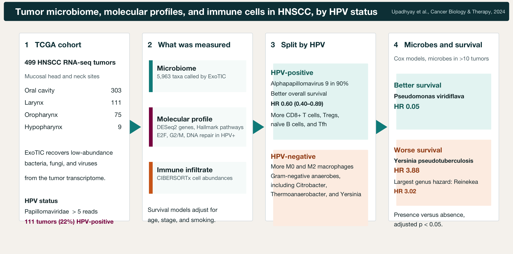

# exohnscHPV 

Code for the study of the head and neck tumor microbiome and its association with human papillomavirus infection.

## Citation

Upadhyay R, Dhakal A, Wheeler C, Hoyd R, Jagjit Singh M, Karivedu V, Bhateja P, Bonomi M, Valentin S, Gamez ME, Konieczkowski DJ, Baliga S, Grecula JC, Blakaj DM, Gogineni E, Mitchell DL, Denko NC, Spakowicz D, Jhawar SR. Comparative analysis of the tumor microbiome, molecular profiles, and immune cell abundances by HPV status in mucosal head and neck cancers and their impact on survival. *Cancer Biology & Therapy*. 2024;25(1):2350249. doi:[10.1080/15384047.2024.2350249](https://doi.org/10.1080/15384047.2024.2350249). PMID: [38722731](https://pubmed.ncbi.nlm.nih.gov/38722731/).

Spakowicz and Jhawar contributed equally.

<br clear="right" />



## Regenerating the manuscript figures

Manuscript figures are drawn by the R Markdown files in `manuscript/scripts/`. Each plotting script writes a PNG under `manuscript/figures/` (300 dpi). Render from `manuscript/scripts` so that `../data` and `../figures` resolve to `manuscript/data` and `manuscript/figures`.

```r
setwd("manuscript/scripts")  # repository root as the starting point
dir.create("../figures", showWarnings = FALSE)
rmarkdown::render("figure-4_visualization.Rmd")
```

Large inputs that are not in the repository are named in `R/cluster-paths.R`. Those `/fs/ess/PAS1695/...` strings are the only absolute paths. Notebooks under `manuscript/scripts/` and `exploratory/scripts/` load that file with `source("../../R/cluster-paths.R")`. Replace the strings in `R/cluster-paths.R` when the files are deposited publicly.

Derived tables already in `manuscript/data/` and `exploratory/data/` are read and written with paths relative to the notebook, including `rarefied-prevalence_all-TCGA-samps.csv` and `hnsc_buffa.csv`.

### Figures, scripts, and outputs

| Manuscript figure | What it shows | Plotting script | PNG |
| --- | --- | --- | --- |
| Figure 1 | Kaplan–Meier overall survival, any papillomavirus vs none | `figure-1_and_figure-3_visualization.Rmd` | `figure1-KM-curve_aggregated-HPV_ALLpaps.png` |
| Figure 2 | Genus-level Cox model volcano (age, stage, smoking) | `figure-2_visualization.Rmd` | `figure2-volcano_survival-multivariate_genus.png` |
| Figure 3 | Species-level Cox model volcano, microbes in at least 10 tumors | `figure-1_and_figure-3_visualization.Rmd` | `figure3-volcano_survival-multivariate_filtered.png` |
| Figure 4 | Microbes differentially abundant by HPV status | `figure-4_visualization.Rmd` | `figure4-differentially_expressed_microbes.png` |
| Figure 5 | Immune-cell abundances by HPV status | `figure-5.Rmd` | `figure5_hnsc_immunecell_boxplot.png` |
| Supplementary Figure S1 | Forest plot for Alphapapillomavirus 9, adjusted for age, stage, and smoking | `supplementary-figure-1.Rmd` | `supp1_exorien_forestplot.png` |
| Supplementary Figure S2 | Genes differentially expressed by HPV status | `supplementary-figure-2_visualization.Rmd` | `supp2_volcano_differential-gene-expression.png` |
| Supplementary Figure S3 | Hallmark gene-set network | `supplementary-figure-3_visualization.Rmd` | `supp3_hallmark_network_analysis.png` |

Figure 4 redraws from `manuscript/data/HPV_deseq.microbes.txt` alone. Figure 5 redraws from `CIBERSORTx_Job12_Results.csv`, `file_id_BAM-expression_link.csv`, and `HPV-prevalence-per-sample.csv` in that same folder.

Figures 1 and 3 also read the clinical table in `drake_2021_07_15` and `kraken_taxonomy`. Figure 2 reads `kraken_taxonomy`. The analysis notebooks read ExoTIC counts, clinical tables, and gene-expression matrices from `drake_2021_07_15` and `drake_2021_07_26` in `R/cluster-paths.R`.

### Rebuild the result tables, then redraw

Render the analysis notebooks when rebuilding the tables from the TCGA and ExoTIC inputs. Install the CRAN packages `tidyverse`, `survival`, `survminer`, `Hmisc`, `ggforce`, `ggrepel`, `ggpubr`, `reshape2`, `msigdbr`, `fgsea`, `geomnet`, `igraph`, `tidygraph`, and `ggraph`, and the Bioconductor package `DESeq2`.

1. **Species-level survival, HPV calls, Figures 1 and 3.** In `figure-2_and_figure-3_analysis.Rmd`, keep the species path (the genus roll-up stays commented, and `rename(microbe = species)` stays active). Point the `write.csv` for `multivar.withns` at `../data/survival_multivar-microbes.csv`. As committed, that line writes `survival_multivar-microbes_genus.csv`. Leave the filtered write pointed at `../data/survival_multivar-microbes_filtered.csv`. The same render writes `HPV-prevalence-per-sample.csv` and `HPV-prevalence-per-sample_ALLpaps.csv`. The setup chunk sources `rarefaction_r` and reads `kraken_counts_hnsc` from `R/cluster-paths.R`. The rarefaction call is commented out, and the notebook reads `../data/rarefied-prevalence_all-TCGA-samps.csv`. Then render `figure-1_and_figure-3_visualization.Rmd`.

2. **Genus-level survival and Figure 2.** In the same analysis notebook, comment out `rename(microbe = species)`, uncomment the genus block (`filter(!is.na(genus))` through `rename(microbe = genus)`), write the unfiltered table to `../data/survival_multivar-microbes_genus.csv`, and write the filtered table to `../data/survival_multivar-microbes_genus_filtered.csv`. Skip the papillomavirus aggregation chunks on this pass; they look for species column names such as `Alphapapillomavirus.9`. Then render `figure-2_visualization.Rmd`.

3. **Figure 4.** Render `figure-4_analysis.Rmd`, which runs DESeq2 on the ExoTIC counts and writes `manuscript/data/HPV_deseq.microbes.txt`. Then render `figure-4_visualization.Rmd`.

4. **Supplementary Figure S2.** Render `supplementary-figure-2_analysis.Rmd`. It writes `manuscript/data/HPV_deseq.genes.txt`. That table is produced by the analysis notebook and is not part of the committed data files. Then render `supplementary-figure-2_visualization.Rmd`.

5. **Supplementary Figure S3.** Render `supplementary-figure-3_analysis.Rmd` after step 4. It writes `manuscript/data/FGSEA_Hallmark-results.csv`. Then render `supplementary-figure-3_visualization.Rmd`, which also reads `HPV_deseq.genes.txt`.

6. **Supplementary Figure S1 and Figure 5.** Render `supplementary-figure-1.Rmd` and `figure-5.Rmd`. Figure 5 uses the HPV prevalence table from step 1 (or the copy already in `manuscript/data`).

## Contributors

* Rebecca Hoyd (processing)
* Caroline Wheeler (deconvolution, microbe differences)
* Malven Jagjit Singh (network, gene expression)
